# Hi there 👋, I'm Mohammad Khakpaki

Welcome to my GitHub! I'm a passionate IT engineer specializing in mobile application development. I thrive on learning new technologies and continuously seek opportunities to expand my skill set. Explore my projects and feel free to connect!

## 🌟 About Me

- 🔭 **Current Role**: Android Developer Developer at Appcent
- 🌍 **Location**: Istanbul, Turkey
- 🌐 **LinkedIn**: [Connect with me on LinkedIn](https://www.linkedin.com/in/mkhakpaki/)
- ✨ **Interests**: Mobile Development, Clean Code Practices, Continuous Learning

## 🚀 Skills & Technologies

- **Programming Languages**: Kotlin, Java
- **Frameworks & Tools**: Android SDK, Jetpack Compose
- **Other Skills**: Clean Code, Test-Driven Development, Agile Methodologies, BLE, Bluetooth, Real-Time Systems, Localization Support

## 💼 Experience

- **Android Developer at Appcent (2023 – Present)**
  - ✨ Played a key role in developing and managing the official Istanbul Airport app as part of the Appcent team.
  - 🔧 Implemented clean code practices to ensure maintainable and scalable codebases.
  - 🚀 Collaborated with cross-functional teams to deliver projects on time.
  - 📊 Optimized application performance, resulting in a 25% reduction in load times.
  - 🔄 Successfully integrated third-party APIs, including payment gateways and in-app purchase systems.
  - 🌐 Implemented multilingual support and enhanced accessibility for international users.
  - 🔌 Integrated BLE-based solutions for indoor navigation and improved app connectivity.

- **Android Developer at PoiLabs (2021 – 2023)**
  - 🔌 Worked extensively on Bluetooth and indoor positioning technologies to enhance navigation experiences.
  - 🔧 Contributed to building innovative solutions for smart retail and navigation.
  - ⚙️ Designed and developed scalable Android applications for various enterprise clients.
  - 🔬 Ensured compatibility with diverse hardware and software environments.

## 🌱 Currently Learning

- Exploring advanced Android development techniques and new mobile frameworks.

## 🖋️ Publications

- **Yazılımcı Olmak: Başlangıç Seviyesindeki Kişiler İçin Anahtar Stratejiler**
  - 📄 [Read the article on Medium](https://medium.com/appcent/yazılımcı-olmak-başlangıç-seviyesindeki-kişiler-i̇çin-anahtar-stratejiler-54ddc9a50573)

- **Android In-App Purchases Made Easy**
  - 📄 [Read the article on Medium](https://medium.com/appcent/android-in-app-purchases-made-easy-0f77e69aa441)

- **Google Play Console'da Kapalı Test**
  - 📄 [Read the article on Medium](https://medium.com/appcent/google-play-console-da-kapalı-test-4c51514c2d7e)

- **ViewModel Nasıl Hayatta Kalıyor?**
  - 📄 [Read the article on Medium](https://medium.com/appcent/viewmodel-nas%C4%B1l-hayatta-kal%C4%B1yor-5b493ef1e882)

- **Demystifying Google TalkBack: A Technical Deep Dive into Android Accessibility**
  - 📄 [Read the article on Medium](https://medium.com/appcent/demystifying-google-talkback-a-technical-deep-dive-into-android-accessibility-299267189b5)

## 😎 Featured Project

- **Medication Reminder App**
  - 🔗 [Available on Google Play](https://play.google.com/store/apps/details?id=com.mediqation.android) 
  - 🔧 Designed and developed a medication reminder app to help users manage their daily medication schedule.
  - ⚙️ Implemented push notifications and an intuitive user interface to enhance usability.

## 🤝 Let’s Collaborate!

I'm always open to collaborating on innovative projects, contributing to open source, or discussing new ideas. Feel free to reach out!

- 📧 **Contact**: [mohamad.khakpaki@gmail.com](mailto:mohamad.khakpaki@gmail.com)

## 📊 GitHub Stats

